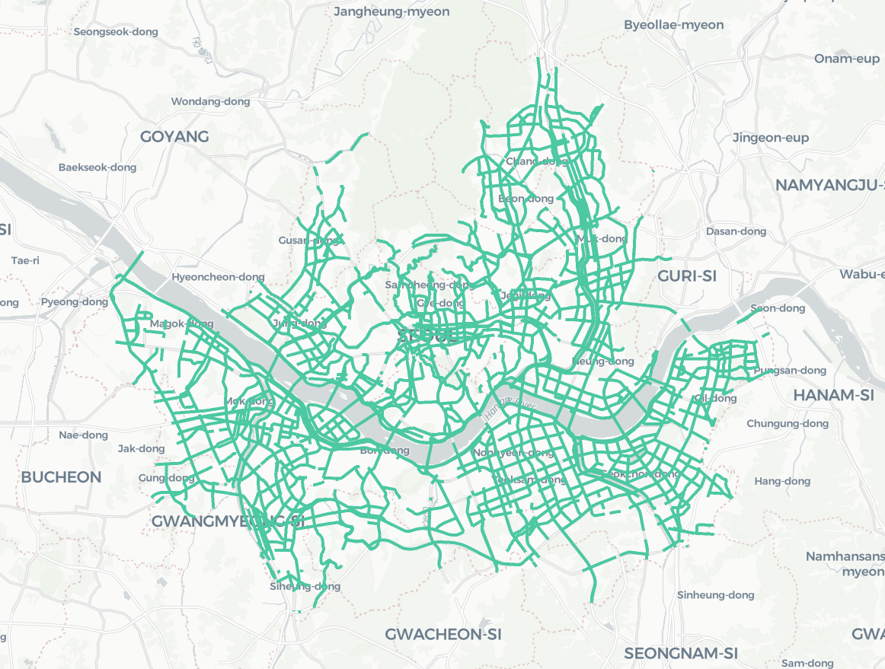

# Seoul Traffic Data

서울 교통 속도 데이터 csv 포맷 정리

데이터 출처는 온전히 서울시 [TOPIS](https://topis.seoul.go.kr/refRoom/openRefRoom_1.do)에 있습니다.

위 링크 공개되어있는 교통 속도 데이터를 파일 포맷을 통일시켜 원활하게 연구에 활용할 수 있도록 정리하였습니다.

본 데이터에서 [표준노드링크정보](http://nodelink.its.go.kr/)는 해당 링크에 있습니다.

데이터의 링크 아이디는 [서울시 표준링크 매핑정보 데이터](https://topis.seoul.go.kr/refRoom/openRefRoom_3_3.do)에서 구하여 아래 이미지와 같이 표준노드링크 데이터와 매핑하여 보실 수 있습니다.

[KAIST CDSNLAB](http://cds.kaist.ac.kr/) 담당자 문의 email: hsm6911@kaist.ac.kr

